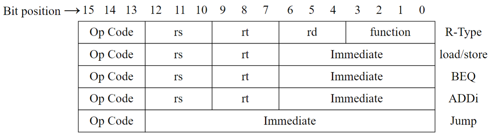
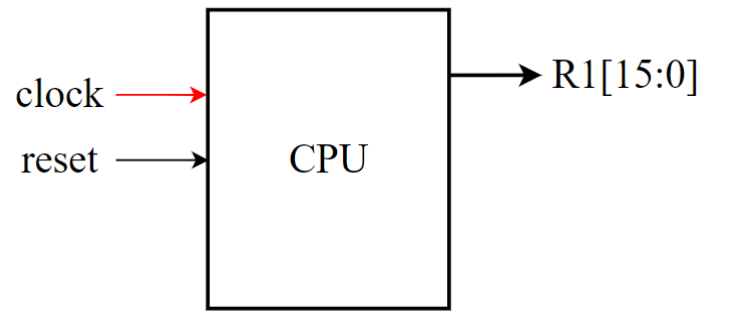
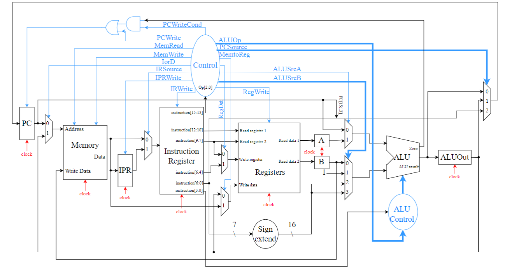
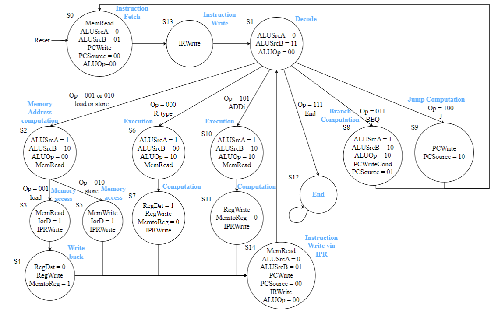
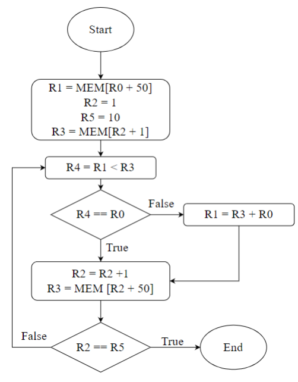
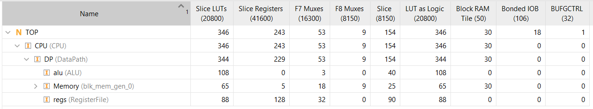
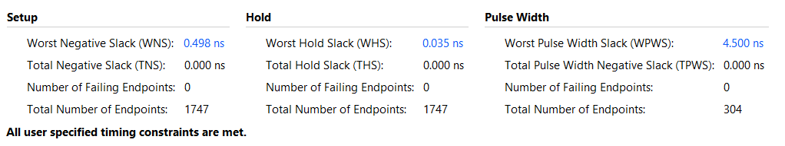
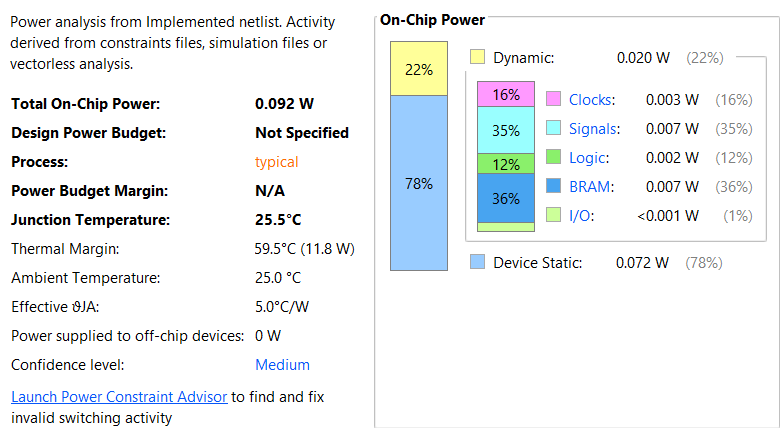

# Design and Implementation of a 16-bit Multi-Cycle Processor
**Date**: Sept-2024

## Table of Contents
1. [Author](#author)
2. [Introduction](#introduction)
3. [Processor Design](#processor-design)
   1. [Instructions](#instructions)
   2. [Instruction Format](#instruction-format)
   3. [ALU Control Signals for Instructions](#table-1-alu-control-signals-for-instructions)
4. [Data-Path Design](#data-path-design)
   1. [Level 0 Data-path Schematic](#level-0-data-path-schematic)
   2. [Level 1 Data-path Schematic](#level-1-data-path-schematic)
5. [Finite State Machine (FSM) Design](#finite-state-machine-fsm-design)
   1. [FSM State Diagram](#fsm-state-diagram)
6. [Implementation](#implementation)
   1. [Test Bench](#test-bench)
   2. [Test Program Instructions](#table-2-test-program-instructions)
   3. [Waveform](#figure-8-waveform)
7. [Reports](#reports)
   1. [Timing Report](#figure-9-timing-report)
   2. [Power Report](#figure-10-power-report)
   3. [Resource Utilization](#figure-11-resource-utilization)
8. [Conclusion](#conclusion)

## Author
[UJJWAL CHAUDHARY](https://www.linkedin.com/in/ujjwal-chaudhary-4436701aa/), M. Tech. ESE 2023-25, IISc Bangalore

## Introduction

This assignment aimed to design and implement a 16-bit multi-cycle processor using the Digilent BASYS3 FPGA Board. Based on a RISC (Reduced Instruction Set Computer) architecture, the processor operates within a 16-bit address space and supports a minimal set of arithmetic, logic, and branch instructions. The design employs a multi-cycle approach, where each instruction is broken down into several stages: fetch, decode, execute, and write-back, each occurring in distinct cycles.

An Instruction Prefetch Register (IPR) was utilized to enhance the processor's efficiency, enabling the concurrent fetching of the next instruction while the current instruction is being processed. By overlapping the instruction fetch stage with the execution of the current instruction, the overall throughput is improved, reducing idle cycles.

The design was tested by implementing an algorithm to find the maximum number from a set of ten random numbers. This report outlines the processor's datapath and finite state machine (FSM) designs, timing analysis, and resource utilization on the Xilinx Artix-7 XC7A35T-1CPG236C FPGA. The test results confirm the processor's ability to perform the required tasks efficiently.

## Processor Design

### Instructions

The instruction set supported by the processor is a limited subset, sufficient for basic arithmetic, logical operations, and control flow mechanisms like branching. 

#### Instruction Format

The ALU control inputs for different instructions, based on their ALUOp and operation types, are listed in Table 1.

#### Table 1: ALU Control Signals for Instructions

| Op Code     | ALUOp | Operation         | Function | Desired ALU action   | ALU Control input |
|-------------|-------|-------------------|----------|----------------------|-------------------|
| load (001)  | 00    | load data          | xxxx     | add                  | 0010              |
| store (010) | 00    | store data         | xxxx     | add                  | 0010              |
| BEQ (011)   | 01    | branch if equal    | xxxx     | subtract             | 0110              |
| R-type (000)| 10    | add                | 0010     | add                  | 0010              |
| R-type (000)| 10    | subtract           | 0110     | subtract             | 0110              |
| R-type (000)| 10    | OR                 | 0001     | or                   | 0001              |
| R-type (000)| 10    | NOR                | 1100     | nor                  | 1100              |
| R-type (000)| 10    | SLT                | 0111     | set on less than     | 0111              |
| R-type (000)| 10    | AND                | 0000     | and                  | 0000              |
| ADDi (101)  | 00    | add immediate      | xxxx     | add                  | 0010              |

### Data-Path Design

The datapath design for the 16-bit processor was constructed using a multi-cycle approach. This means that each instruction is executed over multiple clock cycles, with each stage of execution happening in a distinct phase. 

#### Level 0 Data-path Schematic

#### Level 1 Data-path Schematic

### Finite State Machine (FSM) Design

The Finite State Machine (FSM) design controls the sequence of operations that occur within the datapath during instruction execution.

#### FSM State Diagram

## Implementation

### Test Bench

The testbench developed for this processor verifies its correct operation by simulating a set of instructions that find the maximum value from an array of ten numbers stored in memory. The instructions governing the algorithm are outlined in Table 2.

#### Table 2: Test Program Instructions

| Address | Instruction         | Remark                           | 16-bit Representation |
| ------- | ------------------- | --------------------------------- | --------------------- |
| 0x00    | LD R0, R1, 50        | R1 ← M[R0 + 50]                   | 001 000 001 0110010    |
| 0x01    | ADDi R0, R2, 1       | R2 ← R0 + 1                       | 101 000 010 0000001    |
| 0x02    | ADDi R0, R5, 10      | R5 ← R0 + 10                      | 101 000 101 0001010    |
| 0x03    | LD R2, R3, 50        | R3 ← M[R2 + 50]                   | 001 010 011 0110010    |
| 0x04    | SLT R1, R3, R4       | R4 ← R1 < R3                      | 000 001 011 100 0111   |
| 0x05    | BEQ R4, R0, 0x02     | If R4 == R0; PC ← PC + 1          | 011 100 000 0000001    |
| 0x06    | ADD R0, R3, R1       | R1 ← R3 + R0                      | 000 000 011 001 0010   |
| 0x07    | ADDi R2, R2, 1       | R2 ← R2 + 1                       | 101 010 010 0000001    |
| 0x08    | SLT R2, R5, R4       | R4 ← R2 < R5                      | 000 010 101 100 0111   |
| 0x09    | BEQ R4, R0, 0x03     | If R4 == R0; PC ← PC + 1          | 011 100 000 0000001    |
| 0x0A    | J 0x04               | PC ← 0x04                         | 100 0000000000100      |
| 0x0B    | END                  | End of program                    | 111 0000000000000      |

#### Figure 7: Flow-chart

#### Figure 8: Waveform

### Reports

The timing report from the FPGA synthesis tool confirmed that all setup and hold times were met, and there were no timing violations at 10ns clock period.

#### Figure 9: Timing Report

#### Figure 10: Power Report

#### Figure 11: Resource Utilization

## Conclusion

This project demonstrates the successful implementation of a 16-bit multi-cycle processor on the Digilent BASYS3 FPGA board. Future work could expand the instruction set to support additional operations, such as multiplication and division, and incorporate optimizations like branch prediction to improve performance further.
