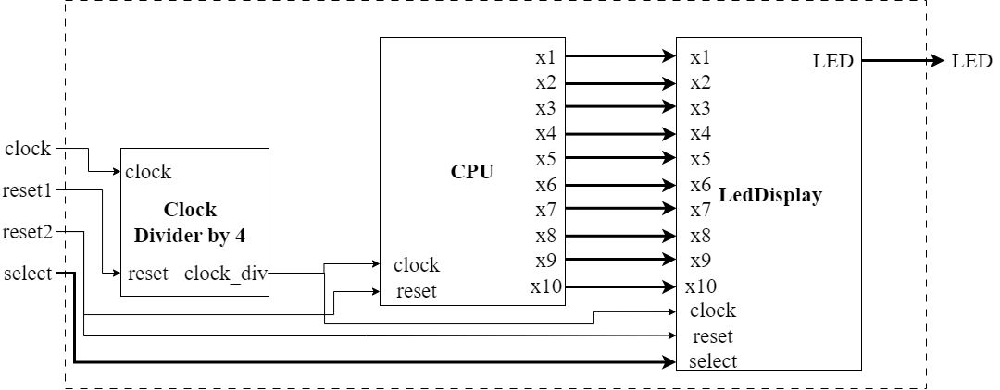

# Design and Implementation of a 32-bit Single-Cycle RISC-V Processor
**Date**: Sept-2024

## Table of Contents
1. [Author](#author)
2. [Introduction](#introduction)
3. [Processor Design](#processor-design)
   1. [Instructions](#instructions)
   2. [Instruction Format](#instruction-format)
   3. [ALU Control Signals for Instructions](#table-1-alu-control-signals-for-instructions)
4. [Data-Path Design](#data-path-design)
   1. [Level 0 Data-path Schematic](#level-0-data-path-schematic)
   2. [Level 1 Data-path Schematic](#level-1-data-path-schematic)
5. [Implementation](#implementation)
   1. [Test Bench](#test-bench)
   2. [Test Program Instructions](#table-2-test-program-instructions)
   3. [Waveform](#figure-8-waveform)
6. [Reports](#reports)
   1. [Timing Report](#figure-9-timing-report)
   2. [Power Report](#figure-10-power-report)
   3. [Resource Utilization](#figure-11-resource-utilization)
7. [Conclusion](#conclusion)

## Author
[UJJWAL CHAUDHARY](https://www.linkedin.com/in/ujjwal-chaudhary-4436701aa/), M. Tech. ESE 2023-25, IISc Bangalore

## Introduction

## Processor Design

### Instructions

#### Instruction Format

The ALU control inputs for different instructions, based on their ALUOp and operation types, are listed in Table 1.

#### Table 1: ALU Control Signals for Instructions

| Op Code     | ALUOp | Operation         | Function | Desired ALU action   | ALU Control input |
|-------------|-------|-------------------|----------|----------------------|-------------------|
| load (001)  | 00    | load data          | xxxx     | add                  | 0010              |
| store (010) | 00    | store data         | xxxx     | add                  | 0010              |
| BEQ (011)   | 01    | branch if equal    | xxxx     | subtract             | 0110              |
| R-type (000)| 10    | add                | 0010     | add                  | 0010              |
| R-type (000)| 10    | subtract           | 0110     | subtract             | 0110              |
| R-type (000)| 10    | OR                 | 0001     | or                   | 0001              |
| R-type (000)| 10    | NOR                | 1100     | nor                  | 1100              |
| R-type (000)| 10    | SLT                | 0111     | set on less than     | 0111              |
| R-type (000)| 10    | AND                | 0000     | and                  | 0000              |
| ADDi (101)  | 00    | add immediate      | xxxx     | add                  | 0010              |

### Data-Path Design

The datapath design for the 16-bit processor was constructed using a multi-cycle approach. This means that each instruction is executed over multiple clock cycles, with each stage of execution happening in a distinct phase. 

#### Level 0 Data-path Schematic

#### Level 1 Data-path Schematic

## Implementation

### Test Bench

#### Table 2: Test Program Instructions

#### Figure 7: Flow-chart

#### Figure 8: Waveform

### Reports

The timing report from the FPGA synthesis tool confirmed that all setup and hold times were met, and there were no timing violations at 10ns clock period.

#### Figure 9: Timing Report

#### Figure 10: Power Report

#### Figure 11: Resource Utilization

## Conclusion

