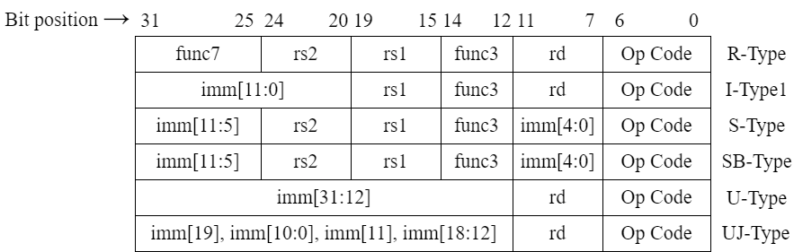
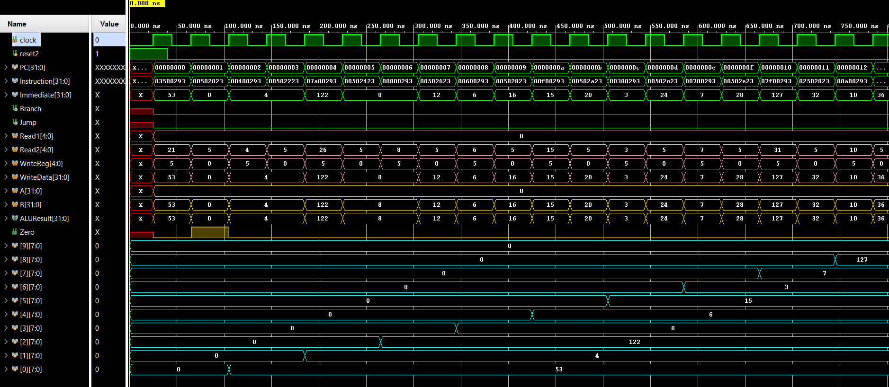
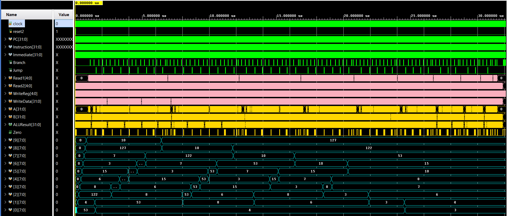
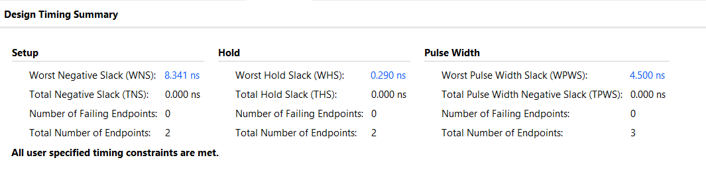
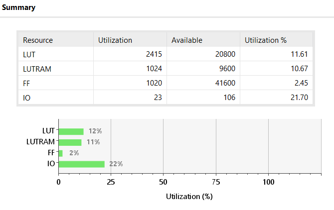
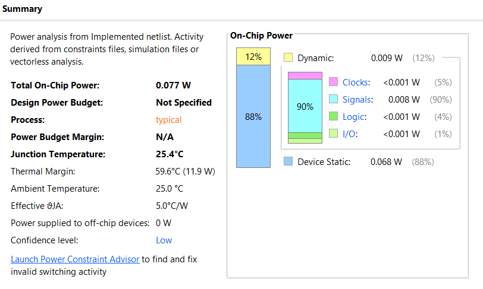

# Design and Implementation of a 32-bit Single-Cycle RISC-V Processor
**Date**: Sept-2024

## Table of Contents
1. [Author](#author)
2. [Introduction](#introduction)
3. [Processor Design](#processor-design)
   1. [Instruction Set Architecture](#instruction-set-architecture)
   2. [Data-Path Design](#data-path-design)
   3. [Key Components of the Datapath](#key-components-of-the-datapath)
   4. [Single-Cycle Datapath Execution](#single-cycle-datapath-execution)
   5. [Clock Division and Display](#clock-division-and-display)
   6. [Level 0 Data-path Schematic](#level-0-data-path-schematic)
   7. [Level 1 Data-path Schematic](#level-1-data-path-schematic)
4. [Control Unit](#control-unit)
   1. [Control Signals](#control-signals)
   2. [Control Logic](#control-logic)
5. [Testing](#testing)
   1. [Test Procedure](#test-procedure)
      1. [Step 1: Writing the Bubble Sort Algorithm in C](#step-1-writing-the-bubble-sort-algorithm-in-c)
      2. [Step 2: Converting C Code to RISC-V Assembly](#step-2-converting-c-code-to-risc-v-assembly)
   2. [Binary Code](#binary-code)
6. [Reports](#reports)
   1. [Timings Summary Report](#timings-summary-report)
   2. [Resource Utilization](#resource-utilization)
   3. [Power Summary](#power-summary)
7. [Conclusion](#conclusion)


## Author
[UJJWAL CHAUDHARY](https://www.linkedin.com/in/ujjwal-chaudhary-4436701aa/), M. Tech. ESE 2023-25, IISc Bangalore

## Introduction 
This report details the design and implementation of a 32-bit single-cycle RISC-V processor, realized on the Digilent BASYS3 FPGA platform, equipped with a Xilinx Artix-7 XC7A35T chip. The processor supports a fundamental subset of the RISC-V instruction set architecture (ISA), focusing on arithmetic, logic, load/store, and branch operations.

The primary objective of this project is to build a functioning single-cycle processor that can execute instructions in a single clock cycle. While this design prioritizes simplicity, it provides a solid foundation for understanding processor architecture. The project includes the design of key processor components such as the datapath and control unit, as well as memory interfacing.

To validate the processor’s functionality, the Bubble Sort algorithm was selected as the benchmark test. By running this sorting algorithm, we were able to verify the processor’s ability to handle complex data manipulation tasks. The results of the algorithm were stored in registers, and the final state was evaluated using the FPGA’s output capabilities. Timing and resource utilization were analyzed, demonstrating the processor’s compliance with FPGA constraints.

## Processor Design

### Instruction Set Architecture
The processor implements a limited subset of the RISC-V ISA, including basic arithmetic, logical operations, and branching instructions. The instruction format used by the processor is shown in the figure below:



Table below shows the list of all the instructions the processor supports with the opcode and function code.

| **Format** | **Instruction** | **Opcode** | **Funct3** | **Funct6/7** |
|------------|-----------------|------------|------------|--------------|
| R-type     | add             | 0110011    | 000        | 0000000      |
| R-type     | sub             | 0110011    | 000        | 0100000      |
| R-type     | or              | 0110011    | 110        | 0000000      |
| R-type     | and             | 0110011    | 111        | 0000000      |
| I-type     | lb              | 0000011    | 000        | n.a.         |
| I-type     | lh              | 0000011    | 001        | n.a.         |
| I-type     | lw              | 0000011    | 010        | n.a.         |
| I-type     | lbu             | 0000011    | 100        | n.a.         |
| I-type     | lhu             | 0000011    | 101        | n.a.         |
| I-type     | addi            | 0010011    | 000        | n.a.         |
| I-type     | slli            | 0010011    | 001        | 0000000      |
| I-type     | ori             | 0010011    | 110        | n.a.         |
| I-type     | andi            | 0010011    | 111        | n.a.         |
| S-type     | sb              | 0100011    | 000        | n.a.         |
| S-type     | sh              | 0100011    | 001        | n.a.         |
| S-type     | sw              | 0100011    | 010        | n.a.         |
| SB-type    | beq             | 1100011    | 000        | n.a.         |
| SB-type    | blt             | 1100011    | 100        | n.a.         |
| SB-type    | bge             | 1100011    | 101        | n.a.         |
| U-type     | lui             | 0110111    | n.a.       | n.a.         |
| UJ-type    | jal             | 1101111    | n.a.       | n.a.         |

The ALU control inputs for different instructions, based on their ALUOp and operation types, are listed in Table 1.

#### Data-Path Design

The 32-bit single-cycle RISC-V processor follows a simplified datapath design, where each instruction is executed in a single clock cycle. This design integrates several core components, including the Program Counter (PC), Instruction Memory, Register File, Arithmetic Logic Unit (ALU), Immediate Generator, and Data Memory. 

#### Key Components of the Datapath

- **Program Counter (PC):** The PC holds the address of the next instruction to be fetched from the instruction memory.
- **Instruction Memory:** This memory module stores the instructions to be executed. 
- **Register File:** The processor includes a register file with 32 registers (x0 to x31).
- **ALU (Arithmetic Logic Unit):** The ALU performs arithmetic and logical operations such as addition, subtraction, AND, OR, and comparisons.
- **Immediate Generator:** For I-type and S-type instructions, the immediate generator extracts the immediate values from the instruction and extends them to 32 bits.
- **Data Memory:** The processor includes a data memory module for load and store operations.

#### Single-Cycle Datapath Execution

In this design, all operations—fetching, decoding, execution, memory access, and write-back—are completed in one clock cycle. Although this simplifies control, it means that the critical path must be optimized.

#### Clock Division and Display

A clock divider was implemented to reduce the clock frequency from 100 MHz to a level compatible with the processor's design. A simple output display using the FPGA’s LEDs showcases results. Below are schematics of the datapath. The RTL schematics of the processor can be found [here](../Assignment_02/Assets/DataMem.pdf).

#### Level 0 Data-path Schematic


#### Level 1 Data-path Schematic


## Control Unit

The control unit generates control signals based on the opcode and funct3 fields of the instruction in the processor.

### Control Signals

- **Branch:** Used to control branch operations.
- **Jump:** Controls jump operations.
- **MemtoReg:** Controls whether data from memory is written to the register file.
- **ALUOp:** Determines the ALU operation.
- **MemWrite:** Indicates whether a write operation should occur in memory.
- **ALUSrc:** Selects the second input for the ALU, either from the register file or the immediate field.
- **RegWrite:** Indicates whether the destination register should be written to.

### Control Logic

The control signals are generated based on the instruction's opcode and funct3 fields. The tables below give information about these control signals.

| **Instruction** | **MemWrite** | **Branch** | **ALUOp1** | **ALUOp0** | **Jump** | **ALUSrc** | **MemtoReg1** | **MemtoReg0** | **RegWrite** | **MemRead** |
|-----------------|--------------|------------|------------|------------|----------|------------|---------------|---------------|--------------|-------------|
| R-format        | 0            | 0          | 1          | 0          | 0        | 0          | 0             | 0             | 1            | 0           |
| I-Type (ld)     | 0            | 0          | 0          | 0          | 0        | 1          | 0             | 1             | 1            | 1           |
| I-Type (Other)  | 0            | 0          | 1          | 1          | 0        | 1          | 0             | 0             | 1            | 0           |
| S-Type          | 1            | 0          | 0          | 0          | 0        | 1          | X             | X             | 0            | 0           |
| SB-Type         | 0            | 1          | 0          | 1          | 0        | 0          | X             | X             | 0            | 0           |
| U-Type          | 0            | 0          | X          | X          | 0        | X          | 1             | 0             | 1            | 0           |
| UJ-Type         | 0            | 0          | X          | X          | 1        | X          | X             | X             | 0            | 0           |

## Testing

To verify the functionality of the designed 32-bit RISC-V Single-Cycle Processor, I tested the CPU by running a Bubble Sort algorithm on an array of 10 integers. The array was initially unsorted, and after sorting, the results were stored in registers x1 to x10. The CPU was set to go into an infinite loop after sorting the array to indicate the end of the program.

### Test Procedure

#### Step 1: Writing the Bubble Sort Algorithm in C

```c
void main() {
    int arr[10] = {53, 4, 122, 8, 6, 15, 3, 7, 127, 10};
    int i, j, temp;

    // Bubble Sort Algorithm
    for(i=0; i<10; i++) {
        for(j=0; j<10-i-1; j++) {
            if(arr[j] > arr[j+1]) {
                temp = arr[j];
                arr[j] = arr[j+1];
                arr[j+1] = temp;
            }
        }
    }
}
```

#### Step 2:Converting C Code to RISC-V Assembly
The C code was then converted into RISC-V assembly, and the assembly code was loaded into the processor's instruction memory. The initial array was stored in the data section, and the sorted array was saved in registers x1 to x10 at the end of execution. Below is the assembly code:

```asm
.data
arr:    .word 53, 4, 122, 8, 6, 15, 3, 7, 127, 10   # Array initialized in memory

.text
.globl _start

_start:
   addi x5, x0, 0  # i = 0
   addi x6, x0, 0  # base address of arr

outer_loop:
   addi x7, x0, 0  # j = 0

inner_loop:
   addi x8, x0, 10  # array size
   sub x8, x8, x5   # 10 - i
   addi x9, x0, 1   # for decrement
   sub x8, x8, x9   # 10 - i - 1
   bge x7, x8, outer_loop_end  # if j >= 10 - i - 1, exit inner loop
   slli x11, x7, 2  # j * 4 (word offset)
   add x12, x6, x11 # base address + offset
   lw x10, 0(x12)   # load arr[j]
   addi x11, x11, 4 # (j+1) * 4
   add x12, x6, x11 # adjust address for arr[j+1]
   lw x13, 0(x12)   # load arr[j+1]
   blt x10, x13, no_swap  # if arr[j] <= arr[j+1], skip swapping
   sw x10, 0(x12)  # swap arr[j] and arr[j+1]
   sw x13, -4(x12)
no_swap:
   addi x7, x7, 1  # increment j
   jal x0, inner_loop  # repeat inner loop

outer_loop_end:
   addi x5, x5, 1  # increment i
   addi x8, x0, 10 # check if outer loop is done
   blt x5, x8, outer_loop  # if i < 10, repeat outer loop

# Store sorted array in registers
lw x1, 0(x0)
lw x2, 4(x0)
lw x3, 8(x0)
lw x4, 12(x0)
lw x5, 16(x0)
lw x6, 20(x0)
lw x7, 24(x0)
lw x8, 28(x0)
lw x9, 32(x0)
lw x10, 36(x0)

# Infinite loop
addi x0, x0, 0
beq x0, x0, -1

```

### Binary Code
The assembly code was then converted into binary instructions and loaded into the instruction memory. The Tables below shows the binary representation of the program.

#### Binary instructions for data initialization and setup

| Address   | Instruction        | Binary Code                           |
|-----------|--------------------|---------------------------------------|
| 0x00000000 | addi x5, x0, 53    | 000000110101 00000 000 00101 0010011  |
| 0x00000001 | sw x5, 0(x0)       | 0000000 00101 00000 010 00000 0100011 |
| 0x00000002 | addi x5, x0, 4     | 000000000100 00000 000 00101 0010011  |
| 0x00000003 | sw x5, 4(x0)       | 0000000 00101 00000 010 00100 0100011 |
| 0x00000004 | addi x5, x0, 122   | 000001111010 00000 000 00101 0010011  |
| 0x00000005 | sw x5, 8(x0)       | 0000000 00101 00000 010 01000 0100011 |
| 0x00000006 | addi x5, x0, 8     | 000000001000 00000 000 00101 0010011  |
| 0x00000007 | sw x5, 12(x0)      | 0000000 00101 00000 010 01100 0100011 |
| 0x00000008 | addi x5, x0, 6     | 000000000110 00000 000 00101 0010011  |
| 0x00000009 | sw x5, 16(x0)      | 0000000 00101 00000 010 10000 0100011 |
| 0x0000000A | addi x5, x0, 15    | 000000001111 00000 000 00101 0010011  |
| 0x0000000B | sw x5, 20(x0)      | 0000000 00101 00000 010 10100 0100011 |
| 0x0000000C | addi x5, x0, 3     | 000000000011 00000 000 00101 0010011  |
| 0x0000000D | sw x5, 24(x0)      | 0000000 00101 00000 010 11000 0100011 |
| 0x0000000E | addi x5, x0, 7     | 000000000111 00000 000 00101 0010011  |
| 0x0000000F | sw x5, 28(x0)      | 0000000 00101 00000 010 11100 0100011 |
| 0x00000010 | addi x5, x0, 127   | 000001111111 00000 000 00101 0010011  |
| 0x00000011 | sw x5, 32(x0)      | 0000000 00101 00000 010 00000 0100011 |
| 0x00000012 | addi x5, x0, 10    | 000000001010 00000 000 00101 0010011  |
| 0x00000013 | sw x5, 36(x0)      | 0000000 00101 00000 010 00100 0100011 |

#### Binary instructions for the Bubble Sort inner loop

| Address   | Instruction        | Binary Code                           |
|-----------|--------------------|---------------------------------------|
| 0x00000014 | addi x5, x0, 0     | 000000000000 00000 000 00101 0010011  |
| 0x00000015 | addi x6, x0, 0     | 000000000000 00000 000 00110 0010011  |
| 0x00000016 | addi x7, x0, 0     | 000000000000 00000 000 00111 0010011  |
| 0x00000017 | addi x8, x0, 10    | 000000001010 00000 000 01000 0010011  |
| 0x00000018 | sub x8, x8, x5     | 0100000 00101 01000 000 01000 0110011 |
| 0x00000019 | addi x9, x0, 1     | 000000000001 00000 000 01001 0010011  |
| 0x0000001A | sub x8, x8, x9     | 0100000 01001 01000 000 01000 0110011 |
| 0x0000001B | bge x7, x8, 12     | 0000000 01000 00111 101 01100 1100111 |
| 0x0000001C | slli x11, x7, 2    | 0000000 00010 00111 001 01011 0010011 |
| 0x0000001D | add x12, x6, x11   | 0000000 01011 00110 000 01100 0110011 |
| 0x0000001E | lw x10, 0(x12)     | 000000000000 01100 010 01010 0000011  |
| 0x0000001F | addi x11, x11, 4   | 000000000100 01011 000 01011 0010011  |
| 0x00000020 | add x12, x6, x11   | 0000000 01011 00110 000 01100 0110011 |
| 0x00000021 | lw x13, 0(x12)     | 000000000000 01100 010 01101 0000011  |

#### Binary instructions for the Bubble Sort outer loop and branching

| Address   | Instruction        | Binary Code                           |
|-----------|--------------------|---------------------------------------|
| 0x00000022 | blt x10, x13, 3    | 0000000 01101 01010 100 00011 1100111 |
| 0x00000023 | sw x10, 0(x12)     | 0000000 01010 01100 010 00000 0100011 |
| 0x00000024 | sw x13, -4(x12)    | 1111111 01101 01100 010 11100 0100011 |
| 0x00000025 | addi x7, x7, 1     | 000000000001 00111 000 00111 0010011  |
| 0x00000026 | jal x0, -15        | 11111110001 1111111 00000 1101111     |
| 0x00000027 | addi x5, x5, 1     | 000000000001 00101 000 00101 0010011  |
| 0x00000028 | addi x8, x0, 10    | 000000001010 00000 000 01000 0010011  |
| 0x00000029 | blt x5, x8, -19    | 1111111 01000 00101 100 01101 1100111 |

#### Binary instructions for loading the sorted array into registers and infinite loop

| Address   | Instruction        | Binary Code                           |
|-----------|--------------------|---------------------------------------|
| 0x0000002A | lw x1, 0(x0)       | 000000000000 00000 010 00001 0000011  |
| 0x0000002B | lw x2, 4(x0)       | 000000000100 00000 010 00010 0000011  |
| 0x0000002C | lw x3, 8(x0)       | 000000001000 00000 010 00011 0000011  |
| 0x0000002D | lw x4, 12(x0)      | 000000001100 00000 010 00100 0000011  |
| 0x0000002E | lw x5, 16(x0)      | 000000010000 00000 010 00101 0000011  |
| 0x0000002F | lw x6, 20(x0)      | 000000010100 00000 010 00110 0000011  |
| 0x00000030 | lw x7, 24(x0)      | 000000011000 00000 010 00111 0000011  |
| 0x00000031 | lw x8, 28(x0)      | 000000011100 00000 010 01000 0000011  |
| 0x00000032 | lw x9, 32(x0)      | 000000100000 00000 010 01001 0000011  |
| 0x00000033 | lw x10, 36(x0)     | 000000100100 00000 010 01010 0000011  |
| 0x00000034 | addi x0, x0, 0     | 000000000000 00000 000 00000 0010011  |
| 0x00000035 | beq x0, x0, -1     | 111111100000 00000 000 11111 1100011  |

#### Simulation Waveform: Showing Change in Different Signals


#### Simulation Waveform: Showing Sorting of Array



## Reports

The timing report from the FPGA synthesis confirms that all setup and hold times are met, with no timing violations at a 21 ns clock period. The timing summary is given in the figure below. The power and resource utilization reports are presented in the following figures:-

#### Timings Summary Report


#### Resource Utilization 


#### Power Summary



## Conclusion

In this project, a 32-bit single-cycle RISC-V processor was successfully designed and implemented on the Digilent BASYS3 FPGA board. The processor supports a basic subset of RISC-V instructions, including arithmetic, logical, load/store, and branching operations. The processor was tested using a Bubble Sort algorithm, which verified its functional correctness. The sorted array was stored in registers, and the processor demonstrated stable performance during execution.

The design process involved creating a complete datapath and control unit, ensuring proper communication between various components such as the ALU, register file, and memory units. The FPGA implementation showed that the processor meets timing requirements with no violations at a 21 ns clock period, and resource utilization was kept within the available limits.

Despite the processor's simplicity, it serves as a robust foundation for understanding single-cycle architectures. Future work could expand the instruction set to support more complex operations, such as multiplication and division, and optimize the design for better clock frequency performance.

This project provides valuable insights into processor design and highlights the importance of optimizing control signals and datapath elements for reliable execution on an FPGA platform.
